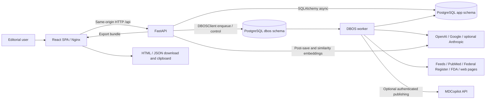
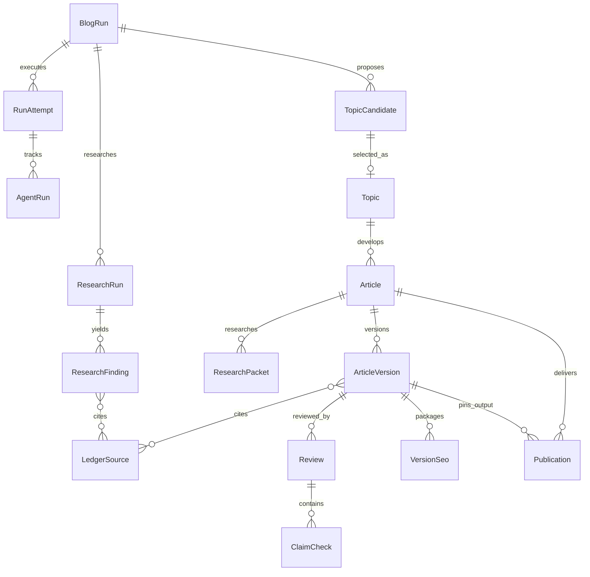
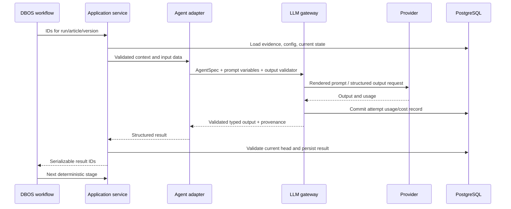
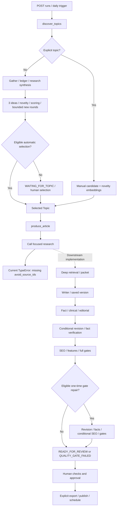

# MDCopilot Blog: technical architecture

This document describes the working tree inspected on 19 September 2026, based on commit `6c8a6cbf33c80ca9ee9343482c259cdbdb4863ed`. Implementation and registered callers take precedence over comments, historical plans, and dependency names. Model names below are configured identifiers, not confirmation of provider availability.

For the editorial process, agent responsibilities, and release rules, read [business_logic.md](business_logic.md). Source links are relative to this file.

**Current execution blocker:** `workflows/produce.py:run_production()` calls `research.deep.run_deep_research()` without its required keyword-only `avoid_source_ids` argument. The only production caller omits it. Source inspection and a read-only Python signature-binding probe confirm a `TypeError` at this boundary, before deep retrieval starts. Fresh article production, research regeneration, and change-topic production cannot traverse the complete pipeline as currently wired. Later stages are implemented and are described below; existing-packet article regeneration and existing-version operations can bypass this particular boundary. No application code was changed for this documentation task.

Evidence: [caller](../backend/src/mdcopilot_blog/workflows/produce.py), [required signature](../backend/src/mdcopilot_blog/research/deep.py), [human-action entry points](../backend/src/mdcopilot_blog/workflows/human_actions.py).

## 1. System purpose and deployment boundary

MDCopilot Blog is a standalone internal editorial application for researching healthcare/AI topics, producing evidence-linked articles, reviewing immutable content versions, and exporting or publishing an approved version. It is not the public MDCopilot website. That website is an optional HTTP integration.

The default deployment has four persistent services and one initialization service:

| Service | Implementation | Responsibility |
| --- | --- | --- |
| `web` | React 19, TypeScript, Vite 8 build; Nginx | Dashboard/editor SPA and same-origin `/api/` proxy |
| `api` | Python 3.12, FastAPI, Uvicorn | Authentication, reads, edits, approvals, configuration, workflow submission |
| `worker` | Same Python image; DBOS 3.0.0 | Durable discovery, generation, rechecks, regeneration, publication, maintenance |
| `db` | PostgreSQL 16 with pgvector | Application records, vectors, sessions, and DBOS execution state |
| `migrate` | One-shot Python CLI | Alembic migrations, DBOS migrations, default data, prompt registration |



The API does **not** launch DBOS. It uses `WorkflowClient`, a wrapper around `DBOSClient`, to enqueue named workflows into PostgreSQL. The worker alone registers and executes them. There is no Redis, Celery broker, separate vector database, or required hosted DBOS service in this deployment.

Sources: [Compose](../docker-compose.yml), [API factory](../backend/src/mdcopilot_blog/api/app.py), [worker](../backend/src/mdcopilot_blog/worker.py), [workflow client](../backend/src/mdcopilot_blog/workflows/client.py), [backend dependencies](../backend/pyproject.toml), [frontend dependencies](../frontend/package.json).

## 2. Project structure and dependency direction

```text
mdcopilot-blog/
├── docker-compose.yml             deployment and startup dependencies
├── .env.example                   operator configuration template
├── backend/
│   ├── Dockerfile                 builder, dev, and runtime targets
│   ├── pyproject.toml / uv.lock    Python dependencies
│   ├── migrations/                Alembic history (0001, 0002)
│   ├── prompts/                   versioned Markdown prompts with metadata
│   └── src/mdcopilot_blog/
│       ├── api/                   routers, dependencies, wire schemas
│       ├── auth/                  local accounts, sessions, CSRF, throttling
│       ├── db/                    SQLAlchemy models and idempotent YAML seeds
│       ├── domain/                contracts, state transitions, scoring, gates
│       ├── services/              persistence and application operations
│       ├── workflows/             DBOS orchestration and recovery
│       ├── agents/                structured prompt-driven agent functions
│       ├── llm/                   provider adapters, routing, usage, pricing
│       ├── research/              collectors, retrieval, extraction, ledger
│       ├── publishing/            rendering and publisher adapters
│       ├── prompts/registry.py    prompt loading, checksums, registration
│       ├── settings.py            environment schema and validation
│       ├── cli.py                 migrations, seeds, accounts, retention
│       └── worker.py              DBOS process entry point
├── frontend/
│   ├── Dockerfile / nginx/        SPA image and HTTP proxy configuration
│   ├── package.json / package-lock.json
│   └── src/
│       ├── main.tsx / router.tsx  React providers and route registration
│       ├── routes/               full application pages
│       ├── features/             domain UI, query hooks, mutations
│       ├── components/ui/        shared UI primitives
│       └── lib/                  HTTP client, query client, wire types
└── docs/                          these architecture and business documents
```

HTTP routers validate and authorize requests, then call services. Services use SQLAlchemy models and pure domain rules. Workflows orchestrate service and research operations as durable steps. Agents produce typed data through the LLM gateway; they do not own transactions or choose the workflow sequence.

`StepContext` supplies effective configuration, the active brand profile, session factory, prompt registry, gateway, and call identifiers. The worker keeps nonserializable objects in a process-local `WorkerRuntime`; DBOS arguments/results are serializable IDs and data. Effective configuration and brand values are loaded again for each step, rather than frozen in a complete per-run configuration snapshot.

Sources: [step context](../backend/src/mdcopilot_blog/services/step_context.py), [runtime](../backend/src/mdcopilot_blog/workflows/runtime.py), [tracked stages](../backend/src/mdcopilot_blog/workflows/stages.py).

## 3. Startup and operation

All application commands run in Docker. From the repository root:

1. Copy `.env.example` to `.env` if the file does not already exist.
2. Set `POSTGRES_PASSWORD`, `SESSION_SECRET` (at least 32 characters), `BOOTSTRAP_ADMIN_EMAIL`, and a nonempty `BOOTSTRAP_ADMIN_PASSWORD`. `openssl rand -hex 32` can generate the session secret. The DBOS URL path assumes a database password without spaces.
3. Configure OpenAI and Gemini credentials for the default generation path. OpenAI supplies web search; Gemini supplies the configured embeddings. Anthropic is an optional fallback; NCBI credentials are optional.
4. Start the application and create an account:

   ```sh
   docker compose up -d --build --wait
   docker compose exec api sh -c 'python -m mdcopilot_blog.cli create-admin --email "$BOOTSTRAP_ADMIN_EMAIL" --display-name Owner'
   ```

5. Open `http://localhost:8310` and sign in.

The startup dependency chain is `db healthy → migrate completed → api/worker`; `web` waits for API health. `cli migrate` runs Alembic upgrade, DBOS migrations in schema `dbos`, idempotent seeds, and prompt synchronization. Setting bootstrap environment values alone does not create a user. Repeating account creation for an existing email leaves that account unchanged.

| Access/probe | Default |
| --- | --- |
| Web UI | `127.0.0.1:8310` → Nginx `8080` |
| Direct API | `127.0.0.1:8300` → Uvicorn `8000` |
| PostgreSQL | `127.0.0.1:5440` → database `5432` |
| API liveness | Direct API `/healthz` |
| API readiness | Direct API `/readyz`, checks `select 1` |
| API schema/docs | Direct API `/openapi.json`, `/docs`, `/redoc` in development only |
| Worker health | `/tmp/worker-heartbeat`, touched every 10 seconds; Compose considers it stale after 60 seconds |

The web proxy forwards `/api/`, not the direct API health or documentation paths. The worker heartbeat proves the event loop is alive; it does not prove that provider credentials work or that jobs are progressing. With `BLOG_AGENT_ENABLED=false`, the worker maintains its heartbeat while intentionally not launching DBOS.

Useful operator commands:

```sh
docker compose ps
docker compose logs --tail=100 api worker
docker compose exec api python -m mdcopilot_blog.cli sync-prompts
docker compose exec api python -m mdcopilot_blog.cli purge-snapshots
docker compose stop
```

`create-user --email ... --display-name ... --role viewer|editor|reviewer|publisher|admin --password-env VARIABLE` creates additional local users; the password must be in that container environment variable. There is no self-registration or account-management page.

For HTTPS, set `APP_ENV=production`, `PUBLIC_APP_URL` to the external origin, `PUBLIC_PROXY_SCHEME=https`, and `SESSION_COOKIE_SECURE=true`, and put an HTTPS reverse proxy in front of the localhost-bound web port. Production disables FastAPI's schema/documentation endpoints. The checked-in Compose file runs built images without development source mounts; source changes require image rebuilds. Optional Docker `dev` targets exist, but Compose selects backend `runtime` and frontend `prod`.

Source: [CLI](../backend/src/mdcopilot_blog/cli.py), [settings](../backend/src/mdcopilot_blog/settings.py), [Nginx](../frontend/nginx/default.conf.template), [Vite](../frontend/vite.config.ts).

## 4. Backend HTTP architecture

`create_app()` installs global CSRF enforcement, trusted-host checking, problem-detail handlers, and explicit router registration. An application lifespan owns the asynchronous database engine/session factory and lazy DBOS client. Sessions use SQLAlchemy 2 with psycopg 3, `pool_pre_ping=True`, and `expire_on_commit=False`. Services explicitly commit at operation boundaries.

Wire models generally accept snake_case or camelCase input, emit camelCase, reject unknown fields, and use UUIDs for entity IDs. Status values retain their domain enum spelling. Common error responses use `application/problem+json` with `type`, `title`, `status`, `instance`, and optional `detail`. Validation responses omit submitted input values. Invalid state/version operations commonly return 409; shape/structure errors return 422; workflow enqueue failures return 503. Unhandled exceptions and middleware responses are not guaranteed to use the custom problem format.

The business API prefix is `/api/blog-agent`. The table lists the registered operations; braces indicate path parameters.

| Area | Endpoints and behavior |
| --- | --- |
| Auth, separate `/api/auth` prefix | `POST /login`, `POST /logout`, `GET /session` |
| Dashboard | `GET /dashboard`: current workflow, review/draft/published summaries and next actions |
| Runs | `POST /runs`; `GET /runs`, `/runs/{run_id}`; `POST /runs/{run_id}/cancel`, `/restart`, `/resume`, `/steps/{step_name}/retry`, `/steps/{step_name}/restart` |
| Research | `GET /research-runs`, `/research-runs/{research_run_id}` |
| Topics | `GET /topics`, `/topics/history`, `/topics/external-posts`, `/topics/similar`; `POST /topics/generate`; `PATCH /topics/{candidate_id}`; `POST /topics/{candidate_id}/select`, `/reject` |
| Articles | `GET /articles`, `/articles/{article_id}`; `PATCH /articles/{article_id}`; `POST /articles/{article_id}/select-title`, `/regenerate` |
| Version/evidence inspection | `GET /articles/{article_id}/versions`, `/versions/{version_id}`, `/diff?from=...&to=...`, `/sources?versionId=...`, `/research-packets` |
| Review decisions | `POST /articles/{article_id}/approve`, `/reject`, `/recheck` |
| Output | `GET /articles/{article_id}/preview?versionId=...`, `/publications`; `POST /articles/{article_id}/export`, `/confirm-published`, `/publish`, `/schedule`, `/unschedule` |
| Sources | `GET /sources`, `/sources/feeds`, `/sources/domains`; `PATCH /sources/feeds/{feed_id}`, `/sources/domains/{domain_id}` |
| Themes/config | `GET/PUT /themes`, `GET/PUT /settings`, `GET /pillars` |

Long-running actions return HTTP 202 and identifiers such as `workflowId`, `workflowName`, `queue`, `runId`, `articleId`, and `candidateId`; callers subsequently query progress. They do not stream token output. Synchronous operations include local edits, title selection, decisions, export rendering, and schedule updates. A content save can call the embedding provider from the API after its first database commit. `GET /topics/similar` also embeds user-entered text synchronously; it requires `blog.view`, provider credentials, and has no run/attempt budget scope.

Source: [registered routers](../backend/src/mdcopilot_blog/api/app.py), [wire models](../backend/src/mdcopilot_blog/api/schemas.py), [errors](../backend/src/mdcopilot_blog/errors.py), [article service](../backend/src/mdcopilot_blog/services/articles.py).

## 5. Authentication and authorization

Authentication is local email/password, independent of the credentials used to publish to MDCopilot. Passwords are hashed with Argon2id through `pwdlib`; empty passwords are rejected, but the current implementation does not impose a longer minimum. Emails are normalized to lowercase. Users have one role and an active flag.

| Role | Cumulative permissions |
| --- | --- |
| Viewer | View application data |
| Editor | Viewer + generate and edit |
| Reviewer | Editor + review, approve, schedule, inspect/control agent runs |
| Publisher | Reviewer + publish/export/confirm |
| Admin | All permissions, including settings/source administration and eligible gate overrides |

Permissions are enforced in API dependencies, with additional state checks in services. The SPA also hides or guards features, but the API is the enforcement boundary. There is no tenant/workspace membership model; authorized users share the application's data. A reviewer who schedules while network publishing is active also needs `blog.publish`.

Login creates a cryptographically random opaque session token. Only its SHA-256 hash is stored. The cookie is HTTP-only, `SameSite=Strict`, path `/`, and optionally Secure (`__Host-mdcb_session` when secure; otherwise `mdcb_session`). Sessions expire after 30 minutes idle or 12 hours absolute; touches are throttled to 60 seconds. Safe polling marked `X-Session-Activity: passive` does not extend idle time. Logging in again in the same browser revokes its previous cookie's session.

Unsafe methods require an allowed Origin and, if provided, same-origin Fetch Metadata. Except for login, authenticated mutations also require `X-CSRF-Token`, an HMAC derived from the session token and `SESSION_SECRET`. Login/session responses provide that token. Trusted hosts include localhost, Docker service names, and the configured public hostname.

Login throttling counts failures over 15 minutes: 5 for an email/IP pair, 10 for an email, or 20 for an IP. With Uvicorn `--no-proxy-headers`, the recorded IP is the direct peer, commonly the web proxy; it is not taken from an arbitrary client forwarding header. Audit rows record logins, account creation, edits, decisions, configuration changes, and publication actions.

Sources: [auth dependencies](../backend/src/mdcopilot_blog/api/deps.py), [RBAC](../backend/src/mdcopilot_blog/domain/rbac.py), [sessions](../backend/src/mdcopilot_blog/auth/sessions.py), [login](../backend/src/mdcopilot_blog/api/routers/auth.py), [throttling](../backend/src/mdcopilot_blog/auth/rate_limit.py).

## 6. Persistence and data ownership

The single PostgreSQL database contains Alembic-owned schema `app` and DBOS-owned schema `dbos`. Most application primary keys are UUIDv7. Datetimes use timezone-aware columns; structured contracts, configurations, and evidence payloads use JSONB alongside relational keys and indexed scalar fields.

| Tables in `app` | What they own |
| --- | --- |
| `users`, `user_sessions`, `login_attempts`, `audit_log` | Identity, sessions, throttling, audit history |
| `blog_settings`, `blog_brand_profiles`, `blog_content_pillars` | Versioned effective settings/brand and weekday content rotation |
| `blog_prompt_versions`, `blog_price_overrides` | Immutable prompt registration and effective-dated pricing overrides |
| `blog_runs`, `blog_run_attempts`, `blog_agent_runs` | User-visible run, individual DBOS execution/fork, tracked stage and costs |
| `blog_llm_calls` | Every recorded agent/search/embedding attempt, usage, provider, price, errors, trace IDs |
| `blog_discovery_themes`, `blog_source_feeds`, `blog_source_domains` | Search themes and retrieval policies/health |
| `blog_research_runs`, `blog_sources` | Query execution, signals, evidence ledger, extracted text snapshots |
| `blog_research_findings`, `blog_finding_sources` | Claims and their many-to-many evidence sources |
| `blog_topic_candidates`, `blog_topics`, `blog_external_posts` | Candidate rounds, selected topic history, optional existing-post import |
| `blog_articles`, `blog_research_packets` | Article lifecycle/current pointers and versioned research packets |
| `blog_article_versions` | Inserted content versions, parent lineage, sections, Markdown, citations, revision resolutions |
| `blog_version_seo`, `blog_version_embeddings`, `blog_version_features`, `blog_article_sources` | Version-specific SEO/social data, vectors, diversity features, citation-to-ledger links |
| `blog_reviews`, `blog_claim_checks` | Automated/human reports and individual fact-check results |
| `blog_publications` | Export/publish state, remote identity, approved version, payload hash, attempts, errors |



This is a conceptual relationship map; some links are JSONB ID arrays or service-enforced references rather than foreign keys. In particular, several LLM call correlation IDs have no database foreign key.

`Article` is the mutable lifecycle record with separate `current_version_id`, `approved_version_id`, and `published_version_id`. Content saves insert versions rather than updating prior content. SEO and reviews are insert-only at the service level; the newest applicable row is selected. These are application conventions, not database triggers that reject all possible updates. Title selection and article tags/category are mutable metadata and have different version behavior from content edits.

Unique/partial indexes enforce one daily run per local date, one active settings/brand row, live slug uniqueness, live article/candidate relationships, version numbers, and workflow-step output identities. Row locks and PostgreSQL advisory locks serialize approvals, version/slug decisions, configuration updates, and publication operations. Services usually commit business records before enqueueing DBOS work; this is not a single cross-schema transactional outbox. Enqueue errors are surfaced, with operation-specific recovery/compensation.

pgvector columns are fixed at **1536 dimensions**, used for topic/argument novelty, external post matching, and article/opening/argument representations. Changing the environment dimension alone does not change the schema or service validation. Keyword/phrase/headline comparisons also use deterministic text operations; not every similarity calculation is a vector query.

The named `blog_pgdata` volume holds durable data. Text snapshots and export metadata are database values; there is no configured object store or upload storage service. Downloads are generated from API responses in the browser. Source snapshots can be purged independently while source identity/metadata survives.

Sources: [model package](../backend/src/mdcopilot_blog/db/models/__init__.py), [schema base](../backend/src/mdcopilot_blog/db/base.py), [version persistence](../backend/src/mdcopilot_blog/services/versions.py), [source retention](../backend/src/mdcopilot_blog/services/retention.py).

## 7. Configuration and environment reference

Configuration precedence is: **domain defaults → environment-backed settings → active database settings row → per-run word-count override**. Only provided database blocks override defaults; routes merge by agent key. A run's `wordCount` selects a rounded ±15% range. Seeds insert missing records but never overwrite an existing record just because its YAML file changed.

The seed settings explicitly store the 07:00 Asia/Kolkata schedule and novelty threshold 0.85, so those stored values can mask later environment changes. Provider credentials, worker enablement, daily scheduler enablement, mandatory human approval, publishing enablement, and budget/time/fetch limits remain environment controls. Publisher *selection* is also represented in effective database settings: the database can override the environment's default publisher, but network publication still requires the environment publishing switch.

Settings saves carry `expectedVersion`, use a configuration advisory lock, create a new active version, and audit the change. A changed schedule enqueues `apply_schedule`; enqueue failure can reactivate the preceding configuration if no newer save has won. Stored prompt selections must reference registered versions. The current Settings UI exposes only automatic/manual topic selection; broader settings exist through the API. Brand/pillar YAML comments about editing those values in Settings do not describe a currently implemented editor.

### Environment variables

`.env.example` contains the common subset; [settings.py](../backend/src/mdcopilot_blog/settings.py) defines the complete backend schema. The loader reads the process environment, not `.env` directly; Compose injects `.env` using `env_file`.

| Variables | Defaults / effect |
| --- | --- |
| `SESSION_SECRET`, `POSTGRES_PASSWORD` | Required; secret length ≥32; DB password used for app and DBOS connections |
| `BOOTSTRAP_ADMIN_EMAIL`, `BOOTSTRAP_ADMIN_PASSWORD` | Read by the explicit account bootstrap command, not automatic account creation |
| `APP_ENV`, `APP_VERSION`, `LOG_LEVEL` | `development`, `0.1.0`, `INFO`; version also controls DBOS execution compatibility |
| `PUBLIC_APP_URL`, `SESSION_COOKIE_SECURE` | `http://localhost:8310`, `false` |
| `PUBLIC_PROXY_SCHEME` | Nginx/Compose control, `http`; set `https` behind the intended HTTPS endpoint |
| `POSTGRES_DB`, `POSTGRES_USER`, `POSTGRES_HOST`, `POSTGRES_PORT` | `mdcopilot_blog`, `mdcopilot_blog`, `db`, `5432`; Compose forces backend host `db` |
| `DB_HOST_PORT`, `API_HOST_PORT`, `WEB_HOST_PORT` | Compose host bindings: `5440`, `8300`, `8310` |
| `OPENAI_API_KEY`, `GEMINI_API_KEY`, `ANTHROPIC_API_KEY` | Optional at boot; availability affects usable generation routes |
| `NCBI_API_KEY`, `NCBI_CONTACT_EMAIL` | Optional PubMed credentials/contact |
| `BLOG_AGENT_ENABLED` | `true`; false rejects new agent actions and leaves worker idle |
| `BLOG_AGENT_SCHEDULER_ENABLED` | `false`; controls daily discovery, not the publication/maintenance schedule set |
| `BLOG_HUMAN_APPROVAL_REQUIRED` | `true`; setting false raises validation failure |
| `BLOG_PUBLISHING_ENABLED` | `false`; network publication safety switch |
| `BLOG_AGENT_DAILY_RUN_TIME`, `BLOG_AGENT_TIMEZONE` | `07:00`, `Asia/Kolkata`; active DB schedule can override |
| `BLOG_AGENT_RESEARCH_WINDOW_DAYS`, `BLOG_AGENT_MIN_SOURCE_COUNT` | `7`, `5` |
| `BLOG_AGENT_NOVELTY_THRESHOLD` | `0.85`; active DB novelty can override |
| `BLOG_AGENT_WORD_COUNT_MIN`, `BLOG_AGENT_WORD_COUNT_MAX` | `850`, `1150`; min must be below max |
| `BLOG_SITE_URL`, `BLOG_DEFAULT_CATEGORY` | `https://www.mdcopilot.health`, `Healthcare AI` |
| `BLOG_AGENT_SEARCH_ROUTE`, `BLOG_AGENT_RESEARCH_ROUTE`, `BLOG_AGENT_IDEATION_ROUTE`, `BLOG_AGENT_DEEP_RESEARCH_ROUTE`, `BLOG_AGENT_WRITER_ROUTE`, `BLOG_AGENT_FACT_CHECK_ROUTE`, `BLOG_AGENT_CLINICAL_ROUTE`, `BLOG_AGENT_EDITORIAL_ROUTE`, `BLOG_AGENT_SEO_ROUTE` | Ordered comma-separated `provider:model` routes; see model section |
| `BLOG_AGENT_EMBEDDING_MODEL`, `BLOG_AGENT_EMBEDDING_DIMENSIONS` | `google:gemini-embedding-2`, `1536`; storage remains fixed to 1536 |
| `BLOG_AGENT_PROVIDER_CONCURRENCY` | `4` per provider/event loop, shared across gateways in a process |
| `BLOG_AGENT_SEARCH_CONTEXT_SIZE_BROAD`, `BLOG_AGENT_SEARCH_CONTEXT_SIZE_DEEP` | `low`, `medium` |
| `BLOG_AGENT_SEARCH_MAX_TOOL_CALLS_BROAD`, `BLOG_AGENT_SEARCH_MAX_TOOL_CALLS_DEEP` | `1`, `2`; allowed range 1–5 |
| `BLOG_AGENT_MAX_COST_PER_RUN_USD` | `5.00`; checked against recorded costs |
| `BLOG_AGENT_DISCOVERY_TIMEOUT_MINUTES`, `BLOG_AGENT_PRODUCTION_TIMEOUT_MINUTES` | `15`, `30` |
| `BLOG_AGENT_MAX_PARALLEL_SEARCHES`, `BLOG_AGENT_MAX_PARALLEL_FETCHES` | `6`, `12` |
| `BLOG_FETCH_CONTACT` | Optional contact in retrieval identity |
| `BLOG_FETCH_CONNECT_TIMEOUT_SECONDS`, `BLOG_FETCH_READ_TIMEOUT_SECONDS` | `5`, `15` |
| `BLOG_FETCH_MAX_BYTES`, `BLOG_FETCH_MAX_REDIRECTS`, `BLOG_FETCH_PER_HOST_LIMIT`, `BLOG_FETCH_ROBOTS_CACHE_HOURS` | `5000000`, `5`, `2`, `24` |
| `BLOG_DBOS_RETENTION_DAYS`, `BLOG_SOURCE_SNAPSHOT_RETENTION_DAYS` | `30`, `365` |
| `BLOG_AGENT_PRICE_AUTO_UPDATE` | `false`; optional pricing-data refresh behavior |
| `BLOG_MDCOPILOT_PUBLIC_API_URL`, `BLOG_MDCOPILOT_SYNC_PAGE_SIZE` | Import disabled when URL empty; page size `50` (max 100) |
| `BLOG_PUBLISHER` | `manual_export` or `mdcopilot_api`; default export |
| `BLOG_PUBLISHER_API_URL`, `BLOG_PUBLISHER_PUBLIC_URL` | `http://host.docker.internal:8000/api/v1`, `http://localhost:3000` |
| `BLOG_PUBLISHER_LOGIN_ID`, `BLOG_PUBLISHER_PASSWORD`, `BLOG_PUBLISHER_LOGIN_PATH` | Network credentials; default login path `/auth/login` |
| `BLOG_PUBLISHER_TIMEOUT_SECONDS` | `20` |
| `WORKER_EXECUTOR_ID` | `worker-1`; stable executor identity for recovery |
| `VITE_API_PROXY_TARGET`, `VITE_USE_POLLING` | Optional Vite development proxy and filesystem polling controls; not production browser API credentials |

Content-level database configuration also includes score weights, novelty lookbacks/thresholds, diversity thresholds, research query limits, prompt versions, and `gateOverridePolicy` (`admin_with_reason` or `never`). See [domain configuration](../backend/src/mdcopilot_blog/domain/config.py) for validated shapes and [config loader](../backend/src/mdcopilot_blog/services/config.py) for precedence.

## 8. Frontend architecture and user-facing modules

`main.tsx` mounts React StrictMode, TanStack Query, the browser router, and Sonner notifications. Route loaders resolve the session before rendering the application layout. Domain hooks in `features/*/api.ts` use a shared `fetch` wrapper with same-origin cookies, JSON serialization, CSRF headers, and typed problem errors. TypeScript DTOs are handwritten mirrors of API contracts, not generated runtime validators.

| Route | Product surface |
| --- | --- |
| `/` | Dashboard: next action, current article/run, counts, recent runs, generation controls |
| `/topics` | Sidebar **Generate**: explicit topic input, topic history, similarity lookup, imported posts |
| `/ideas` | Contextual topic rounds, scores, evidence, edit/reject/select/regenerate controls |
| `/research` | Broad/deep/verification runs, queries, timings, findings, sources |
| `/drafts` | In-production and failed draft list |
| `/review` | Review queue; route requires review permission |
| `/published` | Delivery-related list, including approved/scheduled/exported/publishing/failed/published articles |
| `/articles/:articleId` | Evidence, Markdown editing, headlines, SEO, preview, versions/diffs, publishing |
| `/sources` | Ledger and feed/domain/theme configuration; mutations require settings permission |
| `/settings` | Automatic/manual discovery topic-selection mode; administrator only |
| `/runs` | Contextual run/attempt/step detail and recovery; route requires agent-run permission |
| `/login` | Local account sign-in |

`/ideas`, `/runs`, and article detail are registered contextual routes rather than main sidebar entries. Run/detail reads and review-list reads are available with `blog.view` at the API even when their dedicated SPA route requires more permission.

The editor uses lazily loaded CodeMirror and local React form state. **Save is explicit; there is no autosave.** It submits `baseVersionId` for optimistic concurrency. A newer server version does not replace local text silently: a conflict banner offers loading the latest version. Navigation and browser-unload guards protect dirty state; there is no local-storage draft recovery or automatic merge. API 401 clears session/query state and returns to login.

Preview fetches server-rendered **saved** content and sanitizes it again with DOMPurify. It is not a live preview of unsaved text. Review/regeneration actions receive the form's dirty state; the separate publish panel does not. Publishing still uses the saved approved version, irrespective of unsaved text in the form.

Progress is polling-based, with no WebSocket/SSE channel:

| Query | Explicit interval |
| --- | --- |
| Article detail | 3 seconds during generation/publication, otherwise 10 seconds |
| Article list | 3 seconds if an item is moving, otherwise 15 seconds |
| Run list | 3 seconds while a returned run is nonterminal |
| Run detail page | 3 seconds, including terminal runs |
| Generate request status | 3 seconds until terminal |
| Ideas | 5 seconds |
| Research list/detail | 10 seconds |
| Dashboard summary; source/packet/version/preview/publication queries | No explicit interval; cache lifecycle/invalidation applies |

Mutations invalidate related article/run/research/topic/dashboard queries. Polling one article does not automatically invalidate every separately fetched evidence or preview tab. Most polling requests are passive for session activity. Default query behavior uses a 30-second stale time, no refetch on window focus, no retry for API 4xx errors, and bounded retries for other query errors. Failed queries expose retry controls; mutations use pending states and toasts.

Sources: [router](../frontend/src/router.tsx), [HTTP client](../frontend/src/lib/api.ts), [query client](../frontend/src/lib/query-client.ts), [editor](../frontend/src/routes/article-review-page.tsx), [publish panel](../frontend/src/features/articles/components/publish-panel.tsx), [feature query modules](../frontend/src/features/).

## 9. Agent structure, models, and communication

There are **eight implemented prompt-driven agent adapters referenced by application services**, plus a separate search route and embedding capability. The nine route names include `search`; they do not mean nine autonomous agents. The deep-research integration blocker above prevents a fresh production run from reaching the downstream packet/writer/review calls; their code and existing-data entry paths still exist.

| Adapter | Input supplied by application | Typed output and consumer |
| --- | --- | --- |
| Research Analyst | Broad ledger text/metadata, pillar, time window, unverified search hints | `AnalystDigest`: evidence-linked findings; deterministic claim rules then persist them |
| Topic Strategist | Findings, source metadata, brand/pillars, history/avoid context | `TopicIdeas`: exactly three candidates with rubric scores; services calculate novelty and final ranking |
| Deep Research Analyst | Selected topic and focused ledger source text | `ResearchPacket`: primary/supporting evidence, facts/statistics/counterarguments/context; Writer consumes it |
| Writer | Topic, packet, source text, brand/voice, length, avoid context; optional previous draft/findings/instructions | `ArticleDraft` or `ComponentDraft`; services assemble and save an immutable version |
| Fact Checker | Article sections/pull quote and numbered source text; optional verification sources | `ExtractedClaims`; services resolve spans/source IDs, calculate verdict, persist claims/review |
| Clinical Reviewer | Article/title and brand framing | `ClinicalReview`: summary and recognized flags; service derives blocking/clear verdict |
| Editorial Reviewer | Article, headline options, CTA/excerpt, word limits, brand, avoid context | `EditorialReview`: score, strengths/weaknesses, required/optional changes; feeds revision decisions |
| SEO Specialist | Saved article/title/excerpt, site/category, cited source metadata, internal-link candidates | `SeoPackage`: SEO/social fields; services resolve references, reserve slug, save version SEO |

Adapters call `LLMGateway.run()` with an `AgentSpec`, a prompt name, a Pydantic output type, and application validators. They have no direct database access, MCP servers, tool registrations, shared conversational memory, or ability to call one another. PydanticAI provides structured model execution; Python workflows determine which function runs next. A tracked stage carrying `agent_name="research"` may perform deterministic retrieval without an LLM call.



Source text is numbered `S1…Sn`, with application-owned marker-to-ledger mappings. Most agent source lists contain titles, domains, dates, tiers, access mode, and up to 6,000 characters of text per source; source URLs and UUIDs are omitted from those lists. Source text is wrapped as untrusted input. This is not a claim that every prompt is URL-free: SEO explicitly receives candidate internal URLs. Output validators reject invented markers, unauthorized verification sources, invalid section/span references, duplicate ideas, and mismatched regeneration components.

### Default routing

| Route | Ordered configured defaults |
| --- | --- |
| Search | `openai:gpt-5.4-mini` |
| Research, deep research, clinical | `google:gemini-3.8-flash` → `openai:gpt-5.4-mini` |
| Ideation, editorial | `google:gemini-3.5-flash-lite` → `google:gemini-3.8-flash` → `openai:gpt-5.4-mini` |
| Writer | `openai:gpt-5.4` → `google:gemini-3.8-flash` → `anthropic:claude-sonnet-5` |
| Fact check | `google:gemini-3.8-flash` → `openai:gpt-5.4-mini` → `anthropic:claude-sonnet-5` |
| SEO | `google:gemini-3.5-flash-lite` → `openai:gpt-5.4-mini` |
| Embedding | `google:gemini-embedding-2`, 1536 dimensions, no fallback |

Route validation rejects OpenAI GPT major/minor versions above **5.4** in environment and database settings. This is an application restriction, not a check that a model exists or that the account can access it.

Ordinary agent routes skip providers without credentials. The gateway walks available choices on model API errors, unexpected model behavior, and supported transport errors. Other exceptions propagate. Structured-output validation can request a retry within the same attempt, and exhaustion can advance to another route choice. SDK transport retries are disabled in favor of application control. Current agent specs use 120-second timeouts and one output retry; output budgets range from 2,000 tokens for component writing to 6,000 for research/fact extraction.

Fact checking moves the actual writer provider to the end of its route. Same-provider fallback remains allowed and is recorded as non-independent, which produces a warning rather than a blocking gate.

Search is different: the OpenAI Responses adapter selects the **first usable OpenAI choice from process settings**, uses required `web_search` and `store=False`, and does not walk a fallback route. The effective database `routes.search` override and `SearchQuery.route` are not consumed by that call path. Research bounds URL outcomes to 10 per query. The search provider does not consume `SearchQuery.max_results`.

### Prompts, usage, and budgets

The registry loads 10 prompt names from 11 local files, validates front matter and strict Jinja variables, and defaults to the highest local version. `fact_check/check.v2.md` is the current default; v1 remains an explicit pin option. Worker startup and migration synchronize name/version/checksum/body to the database and reject changed bytes under an already registered version. Add a new version for changed prompt text. Runtime output schema comes from `AgentSpec`, not the descriptive `output` front-matter string. Search instructions live in Python rather than this registry.

`blog_llm_calls` records agent/search/embedding attempt provenance, requested/served model, fallback, prompt hash, tokens, latency, errors, pricing version, and correlation IDs. Structured-output retries within one route attempt are aggregated into that attempt's usage. Preflight failures can happen before any call record exists. Recorder transactions are independent of article transactions, so failed downstream work still leaves spend records.

Budget checks compare **already recorded** spending before calls, rather than reserve an estimated maximum charge. In-flight/concurrent calls can overshoot. Discovery/production shares the run budget; classified human actions have separate attempt budgets. Maintenance calls without run/attempt IDs are not subject to those caps. Total run reporting can include human-action costs even though their budget scope differs.

Pricing uses effective-dated database overrides, served/requested model information and available SDK/`genai-prices` values. Unpriced usage may be recorded at zero with an unpriced marker. Search additionally requires a configured `web_search_call` fee; missing that price blocks search. Embedding token counts are estimated from characters, not a provider token receipt. Price-data auto-update is optional and off by default.

Sources: [agents](../backend/src/mdcopilot_blog/agents/), [gateway](../backend/src/mdcopilot_blog/llm/gateway.py), [providers](../backend/src/mdcopilot_blog/llm/providers.py), [OpenAI search](../backend/src/mdcopilot_blog/llm/search/openai.py), [recorder](../backend/src/mdcopilot_blog/llm/recorder.py), [prompt registry](../backend/src/mdcopilot_blog/prompts/registry.py).

## 10. Research acquisition and evidence data flow

Broad research plans queries deterministically from active themes and the target pillar, rotating never/least-recently searched themes and expanding date templates. Defaults are 10 broad queries including up to 4 pillar queries. Feed collection and web searches run concurrently. Search results are **discovery leads**: their answer summaries are not stored as source evidence text.

| Integration/capability | Actual implementation |
| --- | --- |
| RSS/Atom | `feedparser`; conditional ETag/Last-Modified requests, date filtering, optional DOI-to-PubMed resolution |
| PubMed | NCBI ESearch/ESummary/EFetch; source metadata and abstracts; optional key/contact; local request pacing |
| Federal Register | Configured API queries and publication-date filters |
| FDA device CSV | Weekly polling; first successful fetch establishes IDs without emitting news; subsequent new IDs become signals |
| OpenAI web search | Responses API native `web_search`; citations/action source URLs become retrieval candidates |
| HTTP retrieval | `httpx`, configured headers, redirects/bytes/time limits, public URL checks, per-host and total concurrency |
| HTML extraction | Trafilatura precision, then recall and newspaper4k fallbacks; date metadata/htmldate |
| PDF extraction | pypdfium2 text extraction, up to 200 pages; no OCR |

Signals are canonicalized and merged by URL, enriched with configured domain/feed policy, filtered/ranked, and capped at 40 broad candidates. Known domain rules supply tier, source type, publisher, access policy and verification allowlisting; unknown sources fall back to tier 3. Tier is configured source classification, not a model-generated trust verdict.

Ordinary article fetches inspect robots rules and recheck URL/redirect destinations for allowed HTTP(S), public addresses and ports 80/443. Policy can prevent fetching or retain metadata only. Static `browser_like` headers are not a headless browser. Blocked, short, or failed extraction can yield metadata-only evidence. HTML/PDF needs at least 50 extracted words for full-text classification. PubMed can supply abstract-only evidence. Collectors/API fetches deliberately bypass the ordinary robots check. DNS is checked before connection rather than pinned to a resolved IP, so these checks should not be described as an absolute SSRF guarantee.

The ledger stores canonical URL identity, text snapshot, access/fetch status, date/provenance, tier/type, preprint flag, hashes, and research linkage. Existing full-text/abstract records are reused until their snapshot is marked purged; metadata/error records become eligible for another fetch after 24 hours. This is a URL ledger, not a vector database of document chunks.

Broad synthesis requires at least the configured minimum dated sources within the research window and minimum successful queries (defaults 5 and 6). A successful query may return no URLs. Search failures can mark research partial; feed failures are recorded separately. Insufficient evidence stops before the Analyst runs. Model findings then pass deterministic downgrade/deduplication rules before persistence.

The implemented focused-research function uses up to eight deterministic query facets for the selected candidate, merges newly retrieved and candidate sources, tries to retain its primary source, applies a supplied source-avoid list, and caps the packet source set at 20. Its final threshold additionally requires tier 1/2 full text or an abstract; final dated-source counting is not the same strict recent-window test as broad research. Packet synthesis is a subsequent LLM stage, so deep retrieval timing does not include the packet agent call. These focused-production steps are currently blocked at the caller's missing `avoid_source_ids` argument; the function's source-avoidance logic is not reached through that caller.

Fact checking can launch up to the configured `research.maxVerificationSearches` (default three) for unsupported high-importance/statistical claims. Only configured verification-allowlisted domains are accepted, including a returned-host check. New sources extend the numbered evidence context and can trigger one more fact-check call. Verification evidence is tracked separately; it does not automatically rewrite the article or create a new article citation binding. Ordinary lookup failure keeps the original result; budget exhaustion still propagates.

Sources: [broad research](../backend/src/mdcopilot_blog/research/broad.py), [deep/verification research](../backend/src/mdcopilot_blog/research/deep.py), [query planning](../backend/src/mdcopilot_blog/domain/query_plan.py), [ledger](../backend/src/mdcopilot_blog/research/ledger.py), [retrieval](../backend/src/mdcopilot_blog/research/retriever.py), [extraction](../backend/src/mdcopilot_blog/research/extract.py), [collectors](../backend/src/mdcopilot_blog/research/collectors/).

## 11. Durable workflows, schedules, and recovery



The dotted edge shows implemented downstream orchestration, not a successful transition in the current fresh-production path. The missing deep-research argument raises `TypeError`, which the transient-step retry policy does not retry. Initial production creates its article before this call but assigns the outer workflow's article ID only after the stage returns; failure bookkeeping can therefore leave that new article in `DRAFTING` without a version while the run/attempt fails.

Explicit topics bypass broad research and idea generation, but still undergo novelty and then attempt focused research. Regenerating topics reuses the latest broad research. Auto-selection ordinarily takes only `PASSED` candidates; warned researched ideas require confirmation. The explicit-topic branch can proceed with a warned manual candidate.

| Queue/workflow group | Execution |
| --- | --- |
| `pipeline` | Worker concurrency 1: daily trigger, initial discovery, initial production; trigger/parent releases its slot after enqueueing the child |
| `interactive` | Worker concurrency 4: topic/component/article/research regeneration, change topic, recheck, publish, controls, scheduled maintenance |

Queue limits are per worker. Interactive generation can overlap pipeline work. Provider and fetch/search semaphores add limits inside the executing process; they are not distributed quotas.

The production sequence contains an ordinary review-driven revision and, separately, at most one gate repair. Revision/fix versions get fresh fact checks; clinical/editorial findings may be carried through nearest-ancestor reviews with explicit resolutions rather than rerunning both agents. A pipeline run is `SUCCEEDED` when production ends with either `READY_FOR_REVIEW` **or** `QUALITY_GATE_FAILED`; it does not signify approved or published content.

| Schedule | Behavior |
| --- | --- |
| Daily discovery | Effective local time/timezone; default 07:00 Asia/Kolkata; paused unless daily scheduler enabled |
| `publish_due` | Every 5 minutes UTC; up to 3 due scheduled articles per execution; export or network publish according to configuration at execution time |
| Nightly maintenance | 02:30 effective local timezone: optional external-post sync, feed-health rollup, terminal DBOS-history pruning |
| Source snapshot retention | 03:15 effective local timezone: clear expired snapshots in bounded batches; protect packet-linked sources for articles outside `PUBLISHED`, `REJECTED`, `SUPERSEDED`, and `FAILED` |

Daily creation uses one date-specific row/workflow, skips a same-date manual run unless that manual run is failed/cancelled (even a succeeded manual run suppresses daily creation), and supports startup catch-up only for today after the scheduled time. Automatic historical backfill is off. The daily flag does not disable other registered schedules; disabling the whole agent worker does.

Default DBOS retention is 30 days, pruned in batches of at most 200 completed workflows while preserving relevant parent/fork history. Snapshot retention defaults to 365 days, at most 20 batches of 500 per execution, and keeps ledger metadata. Its protection follows research-packet source IDs; a failed but recoverable article does not protect those snapshots. Changing schedule settings reapplies daily/maintenance schedules; the separately registered snapshot schedule gets its timezone at worker startup.

Standard durable steps retry only recognized transient database/connection failures, up to 6 attempts with a 2-second initial interval and ×2 backoff. Agent model fallback and search retry are separate mechanisms. Search has up to three classified transient attempts, but its retry classifier does not consume every error's `retryable` flag. Publishing steps disable automatic DBOS retries and use explicit retry plus remote reconciliation.

Run controls are stateful operations, not generic process restarts:

- Cancel requests DBOS cancellation and records cancelled run/attempts; stages check cancellation before and after their body.
- Restart requires a terminal, idle run and no protected approved-or-later article; it starts discovery or production based on existing candidate/article state.
- Retry/restart a named step forks retained DBOS history at the relevant function ID, retaining preceding completed outputs.
- Resume handles pending/enqueued executions from an older application version, cancelling/forking them onto the current version.

`APP_VERSION` must match between API submissions and worker execution; otherwise queued work can remain unclaimed. Stable `WORKER_EXECUTOR_ID` and version govern interrupted-work recovery. Source changes to durable step ordering require version management. Publishing/approved state guards, version checks, and stale-workflow detection stop old outputs from overwriting newer human decisions. DBOS identity keys make database outputs replay-aware, but an external model call interrupted before durable recording can still be repeated and billed again.

Sources: [discovery](../backend/src/mdcopilot_blog/workflows/discover.py), [production](../backend/src/mdcopilot_blog/workflows/produce.py), [human actions](../backend/src/mdcopilot_blog/workflows/human_actions.py), [schedules](../backend/src/mdcopilot_blog/workflows/schedules.py), [automation](../backend/src/mdcopilot_blog/workflows/automation.py), [run controls](../backend/src/mdcopilot_blog/services/run_controls.py), [retry policy](../backend/src/mdcopilot_blog/workflows/retry.py).

## 12. Output rendering and website integration

All publication paths render saved version content in Python. Markdown raw HTML and tables are disabled; `nh3` sanitizes a limited Quill-compatible tag/attribute set and HTTP(S) links/images. The renderer links `[S#]` markers to numbered source URLs, appends the pull quote, references, and AI-assistance disclosure, and derives plain text from sanitized HTML. The separate version `cta` field is **not** independently appended; it appears in final HTML only if the article body includes it.

Rendering uses version body/pull quote/excerpt and effective version/ancestor SEO, but selected title/slug/tags/category are article-level values. Normal preview uses the active brand disclosure and current ledger metadata. A repeated stored export uses its captured reference/disclosure values. Historical preview is therefore not a completely frozen publication payload.

Publication format validation checks required title/slug/excerpt and lengths, slug format, nonempty HTML, resolved body markers, SEO existence, valid references, and disclosure. It does not rerun the full editorial gates.

### Default manual export

`export_locked()` executes synchronously in the API for an approved version, records a `manual_export` publication, moves the article to `EXPORTED`, and returns HTML/text/metadata. The database stores the export bundle excluding HTML; repeat download rerenders it. The browser offers clipboard copy and JSON/HTML downloads. There is no automatic website upload in this mode.

After publishing elsewhere, a user submits its HTTP(S) URL. Confirmation records publication `CONFIRMED` and article `PUBLISHED`; it does not fetch the URL or verify the remote article. The manual adapter object exposes capabilities, but its `publish()` method is not the active export path.

### Optional MDCopilot API adapter

Network publication requires `BLOG_PUBLISHING_ENABLED=true`, effective publisher `mdcopilot_api`, an enabled worker, credentials, publication permission, and an approved version. `BLOG_PUBLISHER` provides the default selection; stored settings can override it. Approval itself never enqueues publication. Draft-only approval prevents requesting public network publication.

The adapter logs in with `{phone, password}` at the configured login path, extracts an access-token cookie, clears the HTTP client's cookies, and sends subsequent authenticated requests with a Bearer token. A 401 permits one login/retry. It creates with `POST /admin/blogs`, updates known IDs with `PUT /admin/blogs/{id}`, and searches public `GET /blogs/{slug}` and paginated admin listings to reconcile uncertain or duplicate creates. Adoption requires matching title and slug.

The outbound body contains **only** `title`, `slug`, HTML `content`, `excerpt`, and `status`. SEO/social/tags/category remain local; the adapter advertises `seo_fields=false`. A local publication key/hash and exact-slug reconciliation provide duplicate mitigation; the passed idempotency key is not sent as a remote idempotency header.

The worker commits a local publication claim before HTTP and records the outcome afterward. Failed/uncertain outcomes retain error/attempt information for explicit retry. Both accepted remote drafts and public posts become local `PUBLISHED`; a remote draft can have no public URL and the current UI exposes no subsequent public-promotion operation for that terminal article.

Scheduled delivery chooses its path at due time. Active network mode rechecks the scheduling user's active/publish permission; otherwise the due path prepares an export. Turning the daily discovery scheduler off does not cancel scheduled publication processing. Draft-only approval is enforced for network posting, but the manual export/confirmation path does not enforce remote visibility.

### Optional existing-post import

`BLOG_MDCOPILOT_PUBLIC_API_URL` enables nightly read-only `GET /blogs` pagination, up to 200 pages. Imported published/no-status rows are keyed by origin/slug. Changed title/excerpt invalidates their embedding; missing embeddings are filled in batches. These rows feed novelty/history and SEO internal-link suggestions. Import and authenticated publication have separate URLs/configuration; supplying a public website URL alone does not implement a publishing API.

Sources: [publication services](../backend/src/mdcopilot_blog/services/publications.py), [publication worker steps](../backend/src/mdcopilot_blog/services/publication_steps.py), [renderer](../backend/src/mdcopilot_blog/publishing/renderer.py), [publisher factory](../backend/src/mdcopilot_blog/publishing/factory.py), [MDCopilot adapter](../backend/src/mdcopilot_blog/publishing/mdcopilot_api.py), [post import](../backend/src/mdcopilot_blog/services/external_posts.py).

## 13. Implemented, optional, and residual behavior

| Classification | Evidence-based distinction |
| --- | --- |
| Implemented with a blocking integration defect | All eight adapters have service callers, but fresh production stops at the missing `avoid_source_ids` argument before focused research and downstream generation |
| Implemented | Immutable content lineage, citations, usage records, explicit approval, local export, run recovery, scheduled delivery |
| Optional | Daily discovery; network MDCopilot publishing; external-post import; Anthropic fallback; NCBI key; pricing auto-update; per-domain fetch modes |
| API-only/broader than UI | Most settings fields, historical-version preview parameter, metadata-only edits, recheck of approved articles, some topic/run query parameters |
| Configured but not consumed | Effective DB search-route override; `SearchQuery.route` and provider-side `max_results`; SEO adapter's accepted `brand` argument; prompt front-matter `output` as a schema selector |
| Retained alternate version | Fact-check prompt v1 is registered but not the default; explicit pinning can still invoke it |
| Uninvoked interface methods | `ManualExportPublisher.publish/find_existing`; network adapter's public `find_existing` wrapper. Its private reconciliation path is actively used |
| Historical schema | Migrations still create `blog_notifications` and `blog_calendar_slots`; no current ORM/service/router/UI uses those features |
| Stale references | Older workspace documentation pointers and some source comments describe removed/broader screens; README's backup-script command points to a file absent in the inspected working tree |
| Not implemented in current application | MCP integration, autonomous agent chat/tool delegation, social posting, image generation, browser-based research/OCR, public blog hosting, email notification delivery, signup/password reset, calendar UI, analytics UI |

Do not infer functionality from a retained enum, DTO field, prompt metadata, or migration table. For example, social copy is generated and stored, but there is no LinkedIn/X/newsletter publishing integration.

## 14. Design choices and verification boundary

The implemented architecture separates human-facing state from durable execution, uses typed outputs and deterministic evidence rules around LLM calls, keeps source identities under application control, and binds approval/publication to a saved content version. It favors bounded repair and explicit intervention over indefinite agent loops. PostgreSQL owns both persistence and workflow coordination, simplifying deployment while making database availability central to every path.

Important practical limits are also part of the design as implemented: settings can change between stages; metadata does not share all content-version semantics; lineage reviews can be reused after revision; cost checks are not reservations; export confirmation is a human assertion; and local `PUBLISHED` can represent a remote draft. Content saves first persist a new version, then record embedding-derived features; a later 503 can mean the content was saved but post-save processing failed.

This documentation was checked against source entry points, callers, schemas, models, migrations, prompts, and UI controls. Read-only local probes returned healthy API liveness/readiness and HTTP 200 for the web service during inspection. A source/signature check separately confirmed the deep-research call mismatch. Healthy startup therefore does not imply working end-to-end generation. These checks do not verify live model availability or the remote publishing contract. No paid generation or remote publication was performed for this documentation task.

For a first code walkthrough, follow: [run API](../backend/src/mdcopilot_blog/api/routers/runs.py) → [run service](../backend/src/mdcopilot_blog/services/runs.py) → [discovery workflow](../backend/src/mdcopilot_blog/workflows/discover.py) → [production workflow](../backend/src/mdcopilot_blog/workflows/produce.py) → [quality service](../backend/src/mdcopilot_blog/services/quality.py) → [publication service](../backend/src/mdcopilot_blog/services/publications.py). Pair that with [article review UI](../frontend/src/routes/article-review-page.tsx) and [domain contracts](../backend/src/mdcopilot_blog/domain/contracts.py).
