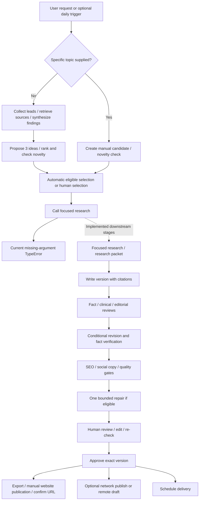
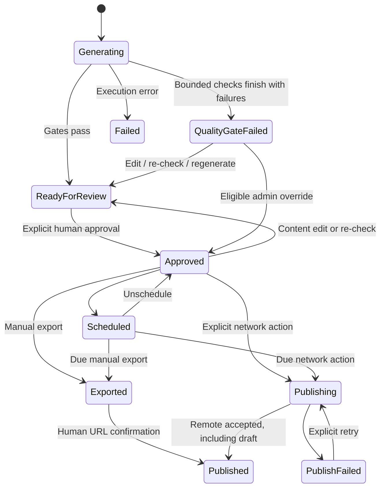

# MDCopilot Blog: product and business logic

This guide explains the implementation inspected on 19 September 2026, based on commit `6c8a6cbf33c80ca9ee9343482c259cdbdb4863ed`. It describes current behavior, including conditional paths and limitations. For deployment, APIs, schema, environment variables, and internal components, see [architecture.md](architecture.md).

**Current generation blocker:** fresh production reaches a deep-research call that omits the required `avoid_source_ids` argument and raises `TypeError` before retrieval. Research regeneration and change-topic production share this problem. This was confirmed through source tracing and a read-only signature check, without running a paid model request. The guide describes the implemented product stages and rules, but a new run cannot currently finish that entire sequence. Existing saved versions and whole-article regeneration from an existing packet have paths that bypass this specific call. No application fix is included in this documentation change.

Evidence: [production caller](../backend/src/mdcopilot_blog/workflows/produce.py) and [deep-research signature](../backend/src/mdcopilot_blog/research/deep.py).

## 1. What the product does

MDCopilot Blog is an internal editorial workspace for turning a healthcare/AI topic into a researched article that a person can inspect, edit, approve, and deliver to a website. It combines source discovery, evidence storage, topic selection, AI drafting and reviews, deterministic quality rules, human approval, and publication tracking.

The seeded brand targets specialist physicians, clinical leaders, and healthcare operations teams. Its editorial position is that AI supports specialist expertise while physicians remain in control. It favors specific evidence, practical workflow implications, responsible AI, and clinically grounded language. The brand profile and source catalog are stored configuration; these are defaults, not hardcoded guarantees about every deployment's content.̌

Primary use cases are:

- Ask for a draft on a specific topic.
- Discover recent developments and propose evidence-backed article ideas.
- Run optional daily discovery using a content-pillar rotation.
- Review the draft's claims, sources, clinical/editorial concerns, and quality failures.
- Edit or regenerate part/all of a draft while retaining version history.
- Approve a particular version, then export it or send it to the configured MDCopilot API.
- Inspect failed runs and recover eligible workflows without discarding prior records.

The application is an authoring and delivery workspace, not the public website or a clinical decision-support service. Generated social copy is a deliverable; automatic posting to social networks is not implemented. Generation never automatically grants human approval.

Source: [brand seed](../backend/src/mdcopilot_blog/db/seed_data/brand_profile.yaml), [workflow entry points](../backend/src/mdcopilot_blog/workflows/).

## 2. Terms a new developer needs

| Term | Product meaning |
| --- | --- |
| Run | One requested or scheduled content-generation effort, with date, options, progress, and cost |
| Attempt | One execution or recovery fork of a workflow within a run |
| Step / agent run | A tracked piece of work; not every tracked step calls an AI model |
| Research run | Broad discovery, focused deep research, or a targeted verification search, with queries and evidence |
| Source ledger | Saved source identities, URLs, dates, accessibility, extracted text, and provenance |
| Finding | A research claim with evidence, confidence, classification, and source links |
| Topic candidate | An editable proposed article idea with hook/thesis/angle, scores, and novelty decision |
| Topic | A selected candidate promoted into durable topic history |
| Research packet | Versioned writing brief built from focused research: facts, statistics, counterarguments, supporting evidence, and remaining verification needs |
| Article | Mutable lifecycle record linking the topic and current/approved/published content versions |
| Article version | Saved content snapshot with parent, sections, citations, change scope, and author/agent information |
| Review / gate report | Assessment of a particular version; some clinical/editorial evidence can be inherited through version lineage |
| Publication | Record of exporting or submitting an approved version, including attempts, remote identity, outcome, and URL |

The difference between **current**, **approved**, and **published** versions matters. Editing a draft must not silently replace the previously approved or delivered content. Similarly, a successful run means the generation workflow finished, not that an article passed its gates or became public.

## 3. Start and use the application

### Initial setup

An operator creates `.env` from `.env.example`, supplies database/session secrets and administrator credentials, and configures OpenAI/Gemini keys for the default generation path. Start with:

```sh
docker compose up -d --build --wait
docker compose exec api sh -c 'python -m mdcopilot_blog.cli create-admin --email "$BOOTSTRAP_ADMIN_EMAIL" --display-name Owner'
```

Open `http://localhost:8310`. Startup loads migrations, missing defaults, and registered prompts. Account creation is a separate explicit CLI command. Existing seeded settings are retained across restarts and are not overwritten by editing seed YAML. Full requirements and HTTPS configuration are in [architecture.md](architecture.md#3-startup-and-operation).

Provider keys are not required merely to boot the UI/API or inspect stored articles. They are required for the corresponding generation operations. Similarity lookup also sends entered text to the embedding provider, even for a viewer; it can incur cost without a run/attempt budget cap. Content saves perform embedding-based feature processing: a save can persist its version and then return an error if that processing cannot complete. Do not interpret an error response as proof that the edit was discarded.

### Permissions

| Role | Typical work |
| --- | --- |
| Viewer | Inspect drafts, sources, research, and delivery records |
| Editor | Viewer work plus request generation and edit content/topics |
| Reviewer | Editor work plus human review, approval, scheduling, and run recovery |
| Publisher | Reviewer work plus export, confirm external publication, and network publish |
| Admin | All work plus configuration/source management and policy-allowed gate overrides |

Network scheduling additionally requires publication permission. An administrator is the only role that can override eligible gate failures with a written reason. No role can approve a version that has no fact-check record. Server permissions/state checks are authoritative even if a UI control is visible.

### Recommended working sequence

The sequence below explains the product's controls and implemented workflow. At step 3, a fresh run currently encounters the deep-research blocker described above; the later review/delivery steps apply to existing saved content or a pipeline with that wiring corrected.

1. **Generate.** Enter a specific topic on the sidebar's Generate page, or use Dashboard → Generate blog for researched discovery. Dashboard → Generate with options also accepts audience, tone, pillar, and target length.
2. **Select an idea if required.** Open Today's Ideas from the run/dashboard. Inspect candidate evidence, weighted scores, and similarity warnings, then select an eligible candidate. Manual topic-selection mode pauses discovery here.
3. **Monitor research and drafting.** Follow the run's status or open Research. A queued request is not yet a completed article. The explicit-topic page shows the recorded run and offers Open draft when an article ID is available.
4. **Inspect the article.** Review its research packet, citation sources, fact-check claims, clinical/editorial feedback, and quality gates.
5. **Edit and Save.** Keep the section structure and valid source markers. Saving is explicit. Preview shows saved content; it does not show unsaved form text.
6. **Re-check.** After a content save, obtain a current-version fact check and qualifying full gate report. Fix remaining blocking issues, or use an eligible administrator override with a documented reason.
7. **Choose the headline and approve.** Select an available headline or custom title before approval. Approve the exact saved version for a draft or public delivery. Approval alone performs no publication.
8. **Deliver.** Export/download and publish manually, or use the configured network integration. Scheduling performs the applicable delivery action when due.
9. **Record the result.** For manual export, enter the externally published URL and confirm. For network delivery, inspect publication history and any returned error/public URL.

If a headline is changed after checks, the current select-title operation does not itself rerun quality or SEO. A reviewer must account for that change before deciding to approve. Unsaved editor text is never sent by the publish/export buttons; they use the persisted approved version.

## 4. Screens and modules

| Screen | What it does and where its limits are |
| --- | --- |
| Dashboard | Gives next actions, today's article/run status, counts, quality summary and recent runs; starts discovery or customized generation |
| Generate (`/topics`) | Accepts a specific topic; searches selected topic history and semantic similarity; shows imported external posts |
| Today's Ideas (`/ideas`) | Shows candidate rounds, rankings, source support, novelty neighbors, and select/edit/reject/regenerate controls |
| Research | Shows broad/deep/verification runs, query outcomes, timings, findings and source accessibility; research regeneration starts from the article, not this screen |
| Drafts | In-production states and failed drafts |
| Review Queue | Articles in `READY_FOR_REVIEW` or `QUALITY_GATE_FAILED` |
| Published | Includes `APPROVED`, `SCHEDULED`, `EXPORTED`, `PUBLISHING`, `PUBLISH_FAILED`, and `PUBLISHED`; the label does not mean every entry is public |
| Article editor | Evidence, structured Markdown, headline choices, SEO fields, saved preview, versions/diffs, decisions, regeneration and delivery |
| Sources | Search ledger; inspect feeds/domains; administrators edit feed/domain policies and manage themes |
| Settings | Current UI changes only automatic/manual topic selection; most backend configuration remains an API/operator surface |
| Generation runs (`/runs`) | Attempts, steps, errors, overall cost and recovery controls; contextual route with additional permission |

The editor shows generated LinkedIn/X/newsletter copy but has no social-posting action. Version history supports inspection and diffs; there is no restore-version button. Sources has no feed/domain creation or deletion UI; administrators can edit existing entries. Themes can be added and deactivated. There is no user/role-management, calendar, notification, dedicated model/prompt editor, or analytics screen.

Source: [route registration](../frontend/src/router.tsx), [navigation](../frontend/src/app/nav.ts), [article lists](../backend/src/mdcopilot_blog/services/article_views.py), [settings screen](../frontend/src/routes/settings-page.tsx).

## 5. End-to-end content flow



### Entry path A: specific topic

The Generate form sends a trimmed topic, up to 300 characters. The API creates a manual run and queues discovery. The discovery workflow detects the explicit topic and creates a candidate from that topic, with the supplied/default audience and pillar. It skips broad collection, the Research Analyst, and the Topic Strategist.

It still computes candidate/argument embeddings and novelty. A duplicate-like explicit topic becomes `WARNED` instead of being rejected outright, and the explicit branch proceeds automatically. That exception honors the submitted topic; it does not bypass focused research, source requirements, or the later article duplicate gate.

Dashboard options can include `wordCount` from 300 to 3,000, audience/tone up to 300 characters, and a pillar. A requested word count sets an allowed body range of approximately 85–115%, rounded, for that run. Otherwise the default range is 850–1,150 words, subject to stored configuration.

### Entry path B: researched discovery

Without an explicit topic, the system gathers recent leads from configured feeds and web searches, retrieves sources into the ledger, synthesizes findings, and proposes article ideas. Automatic mode selects an eligible passed candidate; manual mode pauses for selection. Even in automatic mode, ordinary warned candidates require human confirmation if no passed candidate is available.

### Entry path C: optional daily discovery

Daily discovery defaults off. When enabled, the default schedule is 07:00 Asia/Kolkata, subject to effective stored configuration. It chooses a pillar by the local weekday unless otherwise specified:

| Day | Pillar | Editorial focus |
| --- | --- | --- |
| Monday | A — Specialist Scarcity & Access | Specialist shortages, access, referral bottlenecks |
| Tuesday | B — Cognitive Architecture & Physician Reasoning | Specialist reasoning and AI augmentation |
| Wednesday | C — Burnout & Administrative Overload | Inbox/workflow burden and administrative effort |
| Thursday | D — The Agentic Shift | Agents, copilots, digital twins, active workflows |
| Friday | E — Governance & Clinical Autonomy | Oversight, safety, transparency, autonomy |
| Saturday/Sunday | NARRATIVE — Narrative Edition | Future-practice narratives with sourced or clearly hypothetical vignettes |

At most one daily run is created per local date. A same-date manual run suppresses the daily run unless that manual run is failed or cancelled; even a successful manual run suppresses it. Worker startup can catch up today's missed time, but not automatically backfill earlier days.

Sources: [request schema](../backend/src/mdcopilot_blog/api/schemas.py), [discovery](../backend/src/mdcopilot_blog/workflows/discover.py), [daily schedule](../backend/src/mdcopilot_blog/workflows/schedules.py), [pillars](../backend/src/mdcopilot_blog/db/seed_data/pillars.yaml).

## 6. How research becomes usable evidence

### Collect leads, then retrieve evidence

Broad research uses active themes and pillar queries, not an AI-generated search plan. Defaults are ten queries, including up to four focused on the pillar, plus enabled RSS/Atom, PubMed, Federal Register, and FDA collectors. Search and feed work runs concurrently.

The system merges duplicate URLs, applies configured domain policies, ranks likely relevance, and retrieves up to 40 broad source candidates. Search answer summaries are unverified hints, not evidence snapshots. A source's date, tier, text, access mode, preprint flag, and retrieval outcome are stored so reviewers can see what the application actually accessed.

Access modes have different implications:

| Mode | Meaning |
| --- | --- |
| `full_text` | Sufficient text extracted from the page/PDF |
| `abstract_only` | Abstract evidence, commonly through PubMed |
| `metadata_only` | Identity/title/date or brief metadata; full content unavailable or deliberately not fetched |

Domain policy may prohibit fetching or permit only metadata. Robots restrictions, network errors, paywalls/bot walls, and short extraction can limit evidence. There is no browser automation, paywall bypass, or scanned-PDF OCR. FDA's first successful CSV fetch establishes a baseline; it does not treat every existing entry as new news. Feed failure streaks can disable a feed after the configured threshold, default five.

### Minimum coverage

Broad synthesis normally requires at least five dated sources inside the seven-day window and six successful search queries. These values are configurable. A successful query can return zero source URLs; therefore source count and query count are separate conditions. Broad coverage does not itself require all five sources to be full text or high tier.

Insufficient coverage stops synthesis and records an insufficient-evidence result. Some failed searches can coexist with usable partial research if thresholds still pass. This does not create fallback invented sources.

### Classify findings conservatively

The Research Analyst contributes claim/evidence text, confidence, category, importance, and source markers. Application rules deduplicate normalized claims and keep at most 25. For findings proposed as `FACT`, rules apply in this order:

| Evidence condition | Result |
| --- | --- |
| Self-reported, supported only by company announcements | Downgrade to `MARKETING_CLAIM` |
| All supporting sources are preprints | Downgrade to `ANALYSIS` |
| All supporting sources are undated | Downgrade to `ANALYSIS` |
| High importance without tier 1/2 full text or abstract evidence | Downgrade to `ANALYSIS` |
| Only metadata outside product-announcement/regulatory categories | Downgrade to `ANALYSIS` |

The original type is retained in `downgraded_from`; the preprint flag reflects cited sources. These rules do not recalculate the model's confidence score or guarantee factual correctness. A structurally valid synthesis can contain zero findings even after passing coverage checks.

### Research the selected topic in depth

The focused-research implementation defines query facets for primary source, announcement, research, regulatory material, statistics, expert commentary, counterarguments, and industry context. It combines new and candidate sources, tries to preserve the primary source, and applies a supplied list of source IDs to avoid. At most 20 sources feed the writing packet. Currently the production caller does not supply that required avoid list, so it fails before any of this focused retrieval runs.

Deep research requires dated-source/query coverage and at least one tier 1/2 full-text or abstract source. Its final dated-source check is broader than the strict recent-window test for broad discovery; some older evidence can contribute after retrieval. The Deep Research Analyst then turns the focused evidence into a packet. Retrieval and packet synthesis are separate tracked stages.

Source: [research pipeline](../backend/src/mdcopilot_blog/research/), [claim rules](../backend/src/mdcopilot_blog/domain/claim_rules.py), [packet creation](../backend/src/mdcopilot_blog/services/article_steps.py).

## 7. How topics are ranked and selected

The Topic Strategist proposes exactly three ideas per round. Each contains a headline/working title, hook, why-now explanation, thesis/core argument, MDCopilot angle, audience, pillar, sources, and three scored editorial/business rubrics. It receives source metadata and synthesized findings rather than browsing independently.

The application then calculates the final score:

| Component | Default weight | Calculation |
| --- | --- | --- |
| Timeliness | 25% | Newest source ≤48 hours: 1.0; ≤7 days: 0.7; ≤30 days: 0.3; older/unknown: 0.1 |
| Novelty | 20% | `1 − maximum relevant semantic similarity` |
| Evidence | 20% | Dated-source coverage, tier 1/2 share, primary-source presence |
| MDCopilot relevance | 15% | Model rubric 1–5 normalized to 0–1 |
| Audience relevance | 10% | Same normalization |
| Editorial potential | 10% | Same normalization |

Weights must total 1. Evidence is `0.4 × min(dated sources, minimum)/minimum + 0.4 × tier1/2 sources/total sources + 0.2 × primary-source presence`. Manual topics without model rubric values use neutral 0.5 rubric values. Score explanations are saved for inspection.

Novelty compares candidate and argument embeddings against relevant history and checks repeated primary-news URLs, headline wording/patterns, and examples. Defaults include topic similarity rejection at 0.85, argument rejection at 0.88, a warning band 0.05 below those thresholds, and a 180-day semantic lookback for local topic/article history. Imported external posts are not date-filtered for semantic matching. Primary-news reuse can reject; repeated headlines/patterns/examples can warn. Manual explicit topics retain a warning instead of novelty rejection.

The workflow can request additional three-idea rounds until a round has three passed/warned candidates or its bounded round allowance is exhausted: by default one initial round plus two regeneration rounds. A new explicit regenerate request receives a new bounded allowance and reuses the existing broad research. Candidate selection considers the latest round, sorted by total score then original position.

| Candidate condition | Selection behavior |
| --- | --- |
| Existing selected candidate | Reused where applicable |
| Explicit manual passed/warned candidate | Can be selected automatically |
| Ordinary `PASSED` candidate in automatic mode | Highest-ranked candidate selected |
| Ordinary `WARNED` candidate | Requires human `confirmWarning` |
| No eligible automatic candidate, or manual selection mode | Run becomes `WAITING_FOR_TOPIC` |
| Novelty `REJECTED`, user `DISMISSED`, or `SUPERSEDED` | Not eligible for selection |

Human rejection marks a candidate `DISMISSED`, distinct from algorithmic `REJECTED`. Topic edits do not immediately recalculate stored candidate scores/embeddings. The downstream article duplicate checks still matter; do not treat an edited candidate's old score as a new calculation.

A different topic can replace an existing draft only in allowed review/failed states. The change-topic workflow supersedes the old article/candidate, links the replacement, cancels old production where needed, and starts focused research for the new selection. Approved-or-later articles are protected from this change.

Sources: [topic steps](../backend/src/mdcopilot_blog/services/topic_steps.py), [topic actions](../backend/src/mdcopilot_blog/services/topics.py), [scoring](../backend/src/mdcopilot_blog/domain/scoring.py), [novelty](../backend/src/mdcopilot_blog/domain/novelty.py).

## 8. Agents: responsibility, trigger, inputs, outputs

The application calls agents in a controlled sequence. Agents do not message or choose one another. Each is a typed prompt operation, and the application validates/saves its output before the next operation. Search, extraction, database writes, scoring, and gate decisions are application capabilities outside the agents.

| Agent | Why it exists / when triggered | Input | Contribution/output |
| --- | --- | --- | --- |
| Research Analyst | Convert broad evidence into usable findings after coverage passes | Numbered ledger sources with text, pillar/date/window, unverified search hints | Up to 25 typed findings; evidence, confidence, categories and source markers; deterministic downgrades follow |
| Topic Strategist | Propose differentiated articles after broad synthesis or explicit idea regeneration | Findings, source metadata, active brand/pillars, coverage/history and avoid list | Exactly three topic ideas, supporting/primary markers, relevance/audience/editorial rubric scores and reasons |
| Deep Research Analyst | Assemble a writer's brief after selected-topic retrieval | Topic brief and focused numbered source text | Research packet: primary/supporting evidence, facts, statistics, counterarguments, context and verification needs |
| Writer | Create initial draft; revise required findings; regenerate requested component/article | Brand/tone/audience, topic, packet, source text, length, recent-content avoid bundle; optional previous content/instructions | Seven-section draft, three title options, pull quote, CTA, excerpt and citations; revisions add explicit finding resolutions |
| Fact Checker | Check initial/revised/fixed/rechecked content | Exact article sections/pull quote, source text, optional allowlisted verification evidence | Claim kinds, importance, spans/locations, source markers, confidence, support statuses and recommended revision; application derives PASS/FAIL |
| Clinical Reviewer | Assess clinical framing after the initial draft fact check | Title/article and brand framing | Summary and flags for advice, autonomy, misinformation, invented anecdotes/experiences, safety framing; blocking flags determine BLOCKED |
| Editorial Reviewer | Assess article usefulness/style after clinical review | Article/options/CTA/excerpt, brand, length and recent-content avoid context | Editorial score, recommendation, strengths/weaknesses, required/optional changes with IDs |
| SEO Specialist | Package saved content after review/revision | Article/title/excerpt, site/category, cited source metadata and permitted internal URLs | SEO title/meta description/slug/keywords/OG fields/tags/category/references; LinkedIn, X and newsletter text |

The current adapter files all have actual application-service callers; they are implemented beyond configuration placeholders. The same Writer function uses separate draft, revise, and component prompts. Topic-specific direct input skips the first two agents and is wired toward the later production agents, but currently stops at the deep-research call defect. Later adapters can also be invoked through applicable existing-packet/version actions.

The source evidence passed to models uses application-assigned `[S1]`, `[S2]`, and similar markers. The application rejects unknown markers and later resolves valid markers to ledger UUIDs and publication URLs. Models cannot establish a source's identity by inventing a new marker. The clinical reviewer does not independently fetch medical literature; its input differs from the fact checker's evidence context.

The LLM gateway uses configured OpenAI/Google/optional Anthropic routes with typed outputs and bounded validation retries. Missing-key providers are skipped in ordinary agent routes. Fact checking prefers another provider than the actual Writer, but same-provider fallback is allowed and disclosed. Native OpenAI web search and Gemini embeddings have different behavior: neither has the ordinary multi-provider fallback walk. Exact configured model names and prompt versions are in [architecture.md](architecture.md#9-agent-structure-models-and-communication).

Source: [agent adapters](../backend/src/mdcopilot_blog/agents/), [prompts](../backend/prompts/), [gateway](../backend/src/mdcopilot_blog/llm/gateway.py), [quality operations](../backend/src/mdcopilot_blog/services/quality_steps.py).

## 9. Draft structure, reviews, and bounded repair

### Structured content

Every full draft has these section keys in this order:

1. Introduction — no heading.
2. Context — heading required.
3. Core argument — heading required.
4. Evidence — heading required.
5. MDCopilot perspective — heading required.
6. Practical implications — heading required.
7. Conclusion — heading required.

It also has provocative, operational, and visionary title options, a pull quote, CTA, and excerpt. The operational title is the initial selection. Section bodies are assembled into canonical Markdown; valid citation markers bind a saved version to sources from its packet. Body word count counts section content, not the separately stored CTA/excerpt/pull quote.

An avoid bundle supplies recent headlines, openings, CTAs, primary sources, repeated phrases, and prohibited language. It informs drafting and deterministic diversity checks. It is not persistent conversational memory owned by an agent.

### Review sequence

Initial production performs Writer → Fact Checker → Clinical Reviewer → Editorial Reviewer. Unsupported/incorrect claims, blocking clinical issues, and editorial requirements become revision findings. If required findings exist, the Writer creates another version with one explicit resolution per finding, and the Fact Checker verifies that new version. SEO is then generated.

For unsupported high-importance/statistical claims, the fact-check service may perform allowlisted verification searches up to a configurable limit (default three) and rerun fact checking once if genuinely new evidence was found. Failed lookup ordinarily preserves the original fact result instead of silently marking claims supported. Verification sources are recorded separately from the article's citation bindings.

Fact-check verdict fails for unsupported/outdated/misleading high-importance claims or statistics, quote/attribution claims, and anecdotes/vignettes. Other unsupported claims can still require revision. Clinical BLOCKING flags and editorial required changes feed the release gates.

Clinical and editorial agents are not automatically rerun after every revision. Gates use the nearest relevant ancestor review plus recorded resolutions. For clinical findings, fixed/removed resolutions count; editorial resolution handling accepts the recorded action. Re-check explicitly reruns facts and the full gates, not all earlier agents.

### One gate repair, then stop

After SEO, the system evaluates the full gate report. If all blocking gates pass, the article is ready for human review. Otherwise:

- Missing source coverage stops with a suggestion to regenerate research.
- Duplicate-topic failure stops with a suggestion to change topic.
- Missing disclosure stops with a configuration-fix suggestion.
- Other repairable failures can trigger one Writer fix pass, another fact check, conditional SEO regeneration, and gates again.

The system stops after that one gate repair, whether the result passes or fails. This gate repair is separate from the earlier review-driven revision. A re-check does not start an automatic repair loop. `QUALITY_GATE_FAILED` is inspectable output, not necessarily a crashed run.

Source: [article assembly](../backend/src/mdcopilot_blog/domain/article_assembly.py), [production sequence](../backend/src/mdcopilot_blog/workflows/produce.py), [fix-pass decisions](../backend/src/mdcopilot_blog/domain/fix_pass.py).

## 10. Release gates and validations

Full, fix-pass, and re-check reports evaluate **15 blocking gates and 4 warnings**. Overall passing means every blocking gate passed. Individual rules inspect structured evidence and stored review results; they are not proof that all statements are medically or editorially correct.

| Blocking gate | Actual requirement |
| --- | --- |
| Sources present | At least the configured number of distinct cited sources, default five, including at least one tier 1/2 source |
| Claims verified | Current-version fact check exists; no high-importance unsupported/outdated/misleading claim |
| No unsupported statistics | Statistic claims must be supported; detected numeric sentences need matching non-bad-status claim coverage |
| No fabricated quotes | Detected section quotations occur in cited snapshots; attribution claims do not have bad support status |
| No unsourced anecdotes | Anecdote claims have source support; no unresolved blocking invented-anecdote/physician-experience flag |
| No duplicate topic | Duplicate assessment passed |
| Word count | Section-body count within effective inclusive min/max |
| Required structure | Seven ordered nonempty sections, correct heading rules, pull quote/CTA present, canonical Markdown matches sections |
| CTA fresh | Nonempty and below configured similarity against recent CTAs; default threshold 0.8 |
| No prohibited language | Configured phrases absent across title options, body/headings, pull quote, CTA, excerpt, SEO and social copy |
| SEO complete | Required fields/lists/social copy present; SEO title ≤60; meta description 120–160; slug valid/unique ≤200; title ≤200; excerpt ≤500; external references actually cited |
| Fact check passed | Current-version fact-check verdict is PASS |
| Clinical clear | Relevant lineage review exists with no unresolved blocking flag |
| Editorial completed | Relevant lineage review exists and required changes have recorded resolutions |
| Disclosure present | Active brand AI-assistance disclosure is nonblank |

Warnings cover independent fact checking, repeated opening, repeated headline pattern, and concentrated primary-source domains. Warnings do not block release by themselves. Some absent diversity inputs are represented as “not evaluated,” so a warning pass should not be confused with proof of broad evaluation.

Default prohibited-language examples include “AI is transforming healthcare,” “revolutionize,” and “game-changer.” The current active brand profile determines the actual list. The disclosure gate checks that the configured text exists; rendering appends it later, rather than requiring the Writer to put it into the body.

Additional request rules include known section/component keys, valid citations, optimistic version IDs, nonblank decision reasons, and unique slugs. Saved SEO edits cannot create an initial SEO record if none exists. Explicit invalid state transitions return conflicts rather than silently advancing content.

Source: [gate implementation](../backend/src/mdcopilot_blog/domain/gates.py), [gate/other enums](../backend/src/mdcopilot_blog/domain/enums.py), [request schemas](../backend/src/mdcopilot_blog/api/schemas_articles.py).

## 11. Editing, regeneration, and human decisions

### Editing is version-aware

Content editing is allowed in `READY_FOR_REVIEW`, `QUALITY_GATE_FAILED`, and `APPROVED`. The Save request must name the current base version. A conflicting edit returns 409, preserving local text in the UI until the user chooses how to proceed.

Content, title-option, pull-quote, CTA, excerpt, or SEO edits insert a new `human_edit` version and retain lineage. The normal UI Save submits the whole form, so even a UI tags/category change typically follows this content-version path. The API also has a tags/category-only path that updates article metadata without a version or gates.

After a content save, the API records version embeddings/features and runs **deterministic-only** gates. The version can appear `READY_FOR_REVIEW` but still needs its own fact check and a qualifying full report before ordinary approval. Older approval fields may remain stored, but the new head/state requires a fresh decision. Post-save feature failure can return 503 after the version was committed; reload the saved state and use re-check/recovery accordingly.

Selecting a headline is a separate operation: it changes article title/selection metadata and audits the choice without creating a version or rerunning gates/SEO. It is locked from approval onward. Changing the title-option text through Save does create a version. Historical version rendering can therefore use the current selected title, not necessarily the exact historical selection.

### Regenerate only the intended scope

The table describes the registered regeneration paths. Research regeneration and change-topic production currently stop at the same missing-argument deep-research boundary as initial production; whole-article regeneration from an existing packet bypasses it.

| Requested scope | What actually reruns |
| --- | --- |
| Headline, introduction, one non-introduction section, pull quote, CTA | Writer component prompt, saved version, fact check, gates/eligible repair; SEO when title options changed |
| Whole article | Writer/reviews/SEO/gates using the latest existing research packet |
| Research | Focused retrieval, new packet, and full article production |
| Topic ideas | New idea round using existing broad research |
| Change topic | Supersede old draft, adopt new selected candidate, then focused research and production |
| Re-check | Current-version fact check and full re-check gates; no automatic repair |

Component/article regeneration is allowed in reviewable states; research regeneration additionally supports failed articles. Approved-or-later content is protected from regeneration. The UI accepts optional regeneration instructions, but the research-regeneration branch queues only article ID: those instructions are audited, not passed into research execution.

The API also permits re-check of an approved article. That path clears approval and requires a fresh human decision; the current UI offers re-check only in its reviewable states. Old/stale workflow results are checked against current version and approval state before changing the article.

### Approval and rejection

Ordinary approval requires:

1. The requested version is still the current version.
2. The article is `READY_FOR_REVIEW` or `QUALITY_GATE_FAILED`.
3. A fact-check record exists for that exact version.
4. A qualifying `full`, `fix_pass`, or `recheck` gate report passes, with a compatible article state.

If gates fail or a qualifying report is absent, policy `admin_with_reason` permits an administrator to override with a nonblank written reason. Policy `never` disables this override. **Missing current-version fact check cannot be overridden.** The system records approving user, time, version, draft/public mode, override reason, human review, and audit entry. Approval performs no network side effect.

Rejection requires a reason and an allowed state transition, then saves human review/audit information. Rejected and superseded articles remain historical records. The application does not provide a general restore/unreject flow.

Source: [editing/regeneration service](../backend/src/mdcopilot_blog/services/articles.py), [version persistence](../backend/src/mdcopilot_blog/services/versions.py), [human workflows](../backend/src/mdcopilot_blog/workflows/human_actions.py), [approval service](../backend/src/mdcopilot_blog/services/quality.py).

## 12. Final output, export, publishing, and scheduling

### What becomes the deliverable

The rendered article contains the saved section body, numbered citation links, pull quote, reference list, and AI-assistance disclosure. HTML is deterministically rendered/sanitized; raw model HTML is not trusted. The separate CTA field is checked and versioned but **is not independently appended by the renderer**. It reaches the final article only when it is included in body Markdown.

An export bundle adds title, slug, excerpt, plain text, SEO, social copy, tags, category, references, and disclosure. Article-level metadata and current brand/source information can influence rendering; stored manual exports preserve their captured references/disclosure on repeat download.

### Manual export: default path

1. Approve the current version.
2. With publish permission, choose Export in the publish panel.
3. The application validates the publication shape, records the approved version, and moves to `EXPORTED`.
4. Copy formatted/plain article content, copy title/slug/excerpt, or download HTML/JSON.
5. Publish using the external website's own process.
6. Enter the HTTP(S) public URL and Confirm published.

Confirmation records the human-supplied result and changes article status to `PUBLISHED`; it does not upload content or fetch/verify that URL. Repeat export is supported for the same approved version. The default `BLOG_PUBLISHING_ENABLED=false` does not disable manual export. Draft-only approval has no separately enforced remote-visibility restriction in the manual path.

### Optional MDCopilot network path

An operator must configure the specific MDCopilot API adapter, its login credentials/API/public URLs, and publishing switch. A public website URL alone is insufficient. The UI exposes the network action only when its server-reported network configuration and permissions allow it.

1. Approve a version for draft or public delivery.
2. Choose the network publish action and confirm in the UI.
3. The API queues an interactive worker workflow.
4. The worker renders the approved version, records an in-progress publication, authenticates, and creates/updates the remote blog post.
5. It saves the remote ID, outcome, URL/time where available, or error for retry.

Draft-only approval cannot be escalated to public posting through the network request. The adapter sends only title, slug, HTML content, excerpt, and remote status. It does not send generated SEO, social copy, tags, or category to the current website API.

For uncertain creates, the adapter searches for the exact slug and requires matching title/slug before adopting/updating a post. This reduces duplicate creation; it is not a remote exactly-once guarantee. Failed publication is explicit and retryable through the permitted action.

An accepted **remote draft** is locally recorded as `PUBLISHED`, even though its public URL can be null. This is a terminal local article state; the current application exposes no follow-up promotion-to-public action for it. Inspect approval mode and publication history, not just the article status, to determine what was delivered.

### Scheduling

Only an approved article can be scheduled, at a future timezone-aware time. The UI interprets the selected time in the browser's local zone and submits UTC. Unschedule returns it to `APPROVED`.

Every five minutes the worker processes up to three due articles. The behavior follows configuration **at execution time**:

- With active network publishing, it rechecks the scheduling user's active status/publication permission, then publishes according to approval mode.
- Otherwise it prepares a manual export; a person must still publish externally and confirm its URL.

If network authorization is no longer valid, the schedule can be removed and the article returned for action. Schedule validation/export failure can also return it to approved state with a failed outcome. Scheduling does not bypass human approval, and disabling daily discovery alone does not stop due-publication processing.

Source: [rendering](../backend/src/mdcopilot_blog/publishing/renderer.py), [publication actions](../backend/src/mdcopilot_blog/services/publications.py), [publication execution](../backend/src/mdcopilot_blog/services/publication_steps.py), [website adapter](../backend/src/mdcopilot_blog/publishing/mdcopilot_api.py).

## 13. State, failure handling, and recovery

Run, article, research, and publication states are separate. The main successful progression is:



This is a product-level summary, not every edge of the domain transition table. Internal generation states include `DRAFTING`, `FACT_CHECKING`, `CLINICAL_REVIEW`, `EDITORIAL_REVIEW`, and `SEO`. A user-visible run can be `WAITING_FOR_TOPIC` while its discovery attempt has already succeeded. A run can be `SUCCEEDED` with a `QUALITY_GATE_FAILED` article.

| Failure/condition | Implemented response and practical next step |
| --- | --- |
| Current missing deep-research argument | `TypeError` before focused retrieval; retrying unchanged code cannot repair it. Inspect run error. A new article can remain `DRAFTING` without a version because it was created before the failing call |
| Missing provider key/usable route | Generation call fails when needed; ordinary agent routes skip missing-key providers; search/embedding do not have equivalent multi-provider fallback |
| Model output violates contract | Bounded structured-output retry, then eligible route fallback; exhaustion fails the operation |
| Search/feed/page failure | Record outcome; partial usable research may continue; evidence thresholds still apply; failing feeds can be disabled |
| Insufficient evidence | Record failure/insufficient-evidence state and stop; inspect Sources/Research or regenerate with appropriate input |
| Unsupported claim | Keep explicit failed evidence, optionally verify with allowlisted search, request revision or fail relevant gates |
| Quality gate remains failed | Stop bounded repair; inspect/edit/research/change topic, or eligible admin override after fact check |
| Budget reached | Stop before a subsequent call; limit checks use recorded spending and can be exceeded by already in-flight calls |
| Database/connection transient | Durable step policy can retry up to six attempts with exponential backoff; semantic/validation failures are not retried by this policy |
| Enqueue fails | Return 503; a run/action may already have committed data. Manual run creation marks the persisted run failed at enqueue |
| Concurrent edit or stale workflow | Reject/conflict or suppress stale state update; reload saved state instead of assuming an overwrite occurred |
| Post-save feature error | New content may already exist; inspect latest version and complete re-check/recovery |
| Worker restart | Eligible same-version/executor DBOS work can recover from durable steps |
| Old application-version workflow | Use eligible Resume controls to cancel/fork pending work onto current version |
| Publication failure | Keep publication attempt/error and approved version; explicit retry with remote reconciliation |
| Session expiry | Return to login; polling is passive and does not keep idle sessions alive; unsaved local form data has no persistent recovery |

Run controls enforce state and retained-history rules:

- **Cancel** signals DBOS and records cancellation. It is not a rollback of all work or already completed external requests.
- **Restart** starts a new eligible attempt for a terminal run, reusing selected topic/article context where applicable.
- **Retry failed step / restart from step** forks retained durable history at that named step.
- **Resume** is specifically for compatible recovery of older-version pending/enqueued work, not a generic resume-anything command.

Protected approved/scheduled/exported/publishing/published states restrict generation recovery. Pruned DBOS history can make step-level recovery unavailable even when user-facing run records remain. Interactive human actions have separate attempts and budget scope, and can be allowed after the original run was cancelled.

Source: [state machine](../backend/src/mdcopilot_blog/domain/state_machine.py), [run controls](../backend/src/mdcopilot_blog/services/run_controls.py), [tracked stages](../backend/src/mdcopilot_blog/workflows/stages.py), [retry policy](../backend/src/mdcopilot_blog/workflows/retry.py).

## 14. Configuration, dependencies, and current limitations

The product depends on PostgreSQL for sessions, content, evidence, and workflow durability. Default generation depends on outbound web access, a usable OpenAI search model, Gemini embeddings, and at least one usable model in each needed agent route. These are configured model identifiers; this inspection did not confirm their availability to a particular provider account.

Effective content settings come from environment defaults overlaid by active database configuration; per-run target length is overlaid last. Configuration is reloaded per workflow step. Changing settings during a run can therefore affect later steps. Human approval cannot be disabled; daily generation and network publication are separate controls.

Optional external-post import reads a configured public API nightly and supplies topic history/novelty and SEO internal links. It is separate from authenticated publishing. While the agent worker is enabled, registered maintenance also rolls up feed health and prunes old durable history. Source snapshots default to 365-day retention; protection follows research-packet source IDs for articles outside `PUBLISHED`, `REJECTED`, `SUPERSEDED`, and `FAILED`. A failed but recoverable article therefore does not protect its snapshots. Stored source identities survive snapshot cleanup, but expired text may no longer be available for later quote checks.

The current implementation has these distinctions:

| Category | What a developer should understand |
| --- | --- |
| Implemented with a known blocker | Eight agent adapters and downstream drafting/review/delivery logic exist; fresh production, research regeneration, and change-topic production stop at the missing deep-research argument |
| Optional/conditional | Daily generation, external-post import, Anthropic fallback, NCBI key, native website publishing, targeted verification searches, revision and one gate repair |
| Broader API than UI | Settings/model/prompt configuration, some recheck/query parameters and metadata-only changes; current Settings screen only changes topic-selection mode |
| Configured but ineffective in that path | Stored `routes.search` does not alter active native search provider; `SearchQuery.route/max_results` are not applied by the provider; arbitrary embedding dimensions do not fit the fixed 1536-dimensional schema |
| Retained alternate/legacy artifacts | Fact-check prompt v1 remains explicitly selectable; old notification/calendar migration tables have no current product flow; some historical comments/docs name removed screens |
| Not implemented | MCP tools or agent chat, autonomous publication approval, public blog hosting, social posting, image generation, source uploads/OCR/browser research, calendar/notification/analytics UI, self-registration/password reset |

The title selection, CTA rendering, inherited review, save-after-commit error, and remote-draft status behaviors described above are current implementation boundaries, not proposed redesigns. Developers should preserve these distinctions when reasoning about output or changing a flow.

This guide is based on source tracing, read-only local health checks, and a signature-binding check that confirms the deep-research blocker. Live paid model generation, external website publication, and browser interaction were not executed as part of the documentation task. The architecture guide provides direct file pointers for tracing `User input → API/services → workflows/agents → tools/models → saved versions/reviews → output`.
